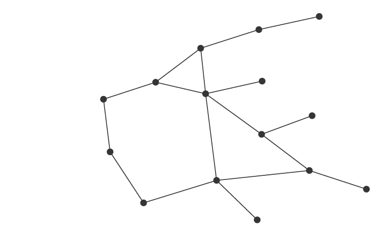
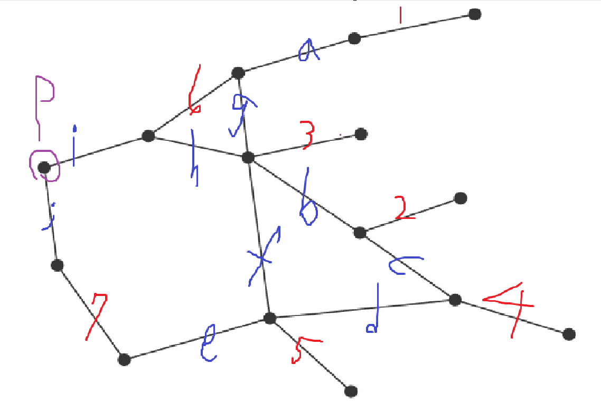
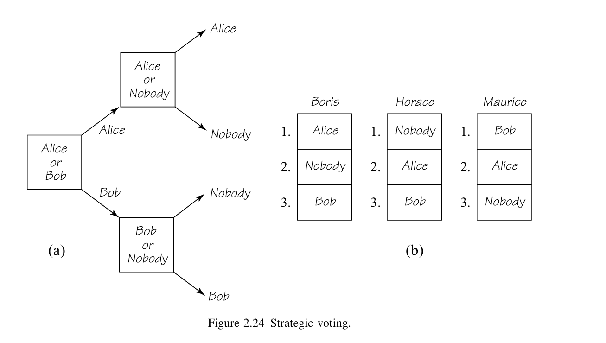

# EX1.

#### a.
the strategy of $A$ is $\{L, R\}$
strategy of $B$ is $\{(l,l), (l,r), (r,l), (r,r)\}$

Therefore, strategic form of this game shown as follow:

| A \ B | $(l,l)$ | $(l,r)$ | $(r,l)$ | $(r,r)$ |
| ----- | ----- | ----- | ----- | ----- |
| **L** | $u_1$ | $u_1$ | $u_2$ | $u_2$ |
| **R** | $u_3$ | $u_1$ | $u_3$ | $u_1$ |

#### b.
saddle points are $\{L, (l, r)\}, \{R, (l, r)\}$

#### c.
the value of this game is $u_1$

# EX2.

the binary representation of the initial board is
|k| number | 1| 2| 4| 8|
|-|-|-|-|-|-|
1|1|1
2|3|1|1
3|7|1|1|1
4|15|1|1|1|1

the board is unbalance, therefore the first player is winner if ze playing optimally

at first round, first player pick $8+2 = 4$ matchsticks from pile 4 to make it balance, the board become

|k| number | 1| 2| 4| 
|-|-|-|-|-|
1|1|1
2|3|1|1
3|7|1|1|1
4|5|1|0|1|

the second take all matchstickers from first pile, the board become

|k| number | 1| 2| 4| 
|-|-|-|-|-|
2|3|1|1
3|7|1|1|1
4|5|1|0|1|

at second round, first player pick 1 from pile 4, the board become

|k| number | 1| 2| 4| 
|-|-|-|-|-|
2|3|1|1
3|7|1|1|1
4|4|0|0|1|

second player pick pile 2, board become

|k| number | 1| 2| 4| 
|-|-|-|-|-|
3|7|1|1|1
4|4|0|0|1|

at third round, player 1 pick 3 from pike 3, board become

|k| number | 1| 2| 4| 
|-|-|-|-|-|
3|4|0|0|1
4|4|0|0|1|

second player pick arbitrary, and then the first pick remaining, the first player win.

# EX3.

- definition in convinience
We called the set which satisfying the condition is a **perfect matching**
- the graph $\mathcal G = (\mathcal V, \mathcal E)$, where $\mathcal V$ is vertices set and $\mathcal E$ is edges set
#### proof of the winning condition
first, we claim the second player's strategy is:
- if an perfect set $E\subseteq \mathcal E$ exist in the first player's turn, assume the first player take one node $p\in \mathcal V$, by definition there exist only one edge in $E$ (calling $e$) with endpoint $P$.
assume the edge $e$ connect $p$ and $q$, then the second player's strategy is take $q$.

- for the case $E$ does not exist in the first player's turn, second player randomly pick one legal node from $\mathcal V$

then we can prove by induction that the second player win by strategy above if the perfect set exists.
- first, consider the case that $E$ have only one edge.
at this case, $\mathcal G$ only have $2$ nodes and one edge, the first player take one, the second take the remaining, and nothing left for the first, therefore ze lose.

- assume the claim is true for $|E|=n = \frac{\|\mathcal V\|}{2}$, then for the case $|E|=n+1$:
following the strategy above, after the second player's action, all vertices of $e$ are removed, and we can find that nodes in $E - \{e\}$ will cover $\mathcal V - \{p,q\}$ again.
In other words, after the second player's turn, the graph $\mathcal G'$ will have a perfect set $E'= E - \{e\}$ with size $|E'| = |E|-1=n$.
by induction hypothesis, the second player can win this game.

<!-- assume the first player take one node $P$, by definition there exist only one edge in $E$ with endpoint $P$.
assume the edge connect $P$ and $P'$, then the second player's strategy is take $P'$. -->

#### proof $E$ does not exist
prove by contradition that $E$ does not exist.
Let's indexing the edge as follow

first, we observe all nodes which only have one connected edge. because $E$ need to cover all vertices, therefore $E$ must include all corresponding edges. In other words, $\{1,2,3,4,5\}\subseteq E$.

Because edges in $E$ cannot have common endpoints, we can find that $\{a,b,c,d,e,f,g\}\cap E = \emptyset$

with the same argument of the first step, we can find that $\{6,7\}\subseteq E$, and by the same argument of the second step, $\{i,j\}\cap E = \emptyset$

therefore, we can find that $E = \{1,2,3,4,5,6,7\}$ if exist. however, the set does not cover $P$ (the purple one), contradict with the definition of $E$, and therefore $E$ does not exist.

#### winning strategy of the first player
The first player pick up $P$(the purple one) in the graph, and then
- it's the second player's round
- $\{1,2,3,4,5,6,7\}$ become a perfect set of the graph after removing $P$

then the first player apply the strategy of previous subproblem(but the character is swapped), then ze can win the game as mentioned above.

<!-- $\succeq$ -->

## EX4.

Let $v(a,b)$ denote the value of the game in strategy $(a,b)$

from the definition of saddle points, we have
- $v(s,t) = v(s',t')=$ the value of this game
- $v(s,t)\preceq v(s, \hat t)\forall \hat t \in$ strategy of player $B$ --- (1)
- $v(s,t) \succeq v(\hat s, t)\forall \hat s \in$ strategy of player $A$ --- (2)

- $v(s',t')\preceq v(s', \hat t)\forall \hat t \in$ strategy of player $B$ --- (3)
- $v(s',t') \succeq v(\hat s, t')\forall \hat s \in$ strategy of player $A$ --- (4)

Therefore, $\forall \hat t\in$ strategies of player $B$, we have
- $v(s,t')\stackrel{(3)}\preceq v(s', t') \stackrel{}{=} v(s,t)\stackrel{(1)}\preceq v(s, \hat t)$
- $v(s',t) \stackrel{2}{\preceq} v(s,t) \stackrel{0} = v(s',t')\stackrel{(4)}{\preceq} v(s',\hat t)$

By the similar step, for any $\hat s\in$ strategies of $A$, we have
- $v(s, t')\stackrel{}{\succeq} v(s, t) = v(s',t')\succeq v(\hat s, t')$
- $v(s',t) \succeq v(s',t')=v(s,t)\succeq v(\hat s,t)$

Therefore, by definition, $(s,t')$ and $(s',t)$ are saddle points.

## EX5.

#### if they vote only by ranking
result of the vte shown as below
|round|Alice|Bob|Nobody|
|-|-|-|-|
|1|2|1|$\emptyset$|
|2|2|$\emptyset$|1|

<!-- at the first  -->
Alice will win

#### strategy of Horace
If Horace vote Bob at first round, vote Nobody at second round, and others still vote by ranking, then the result become
|round|Alice|Bob|Nobody|
|-|-|-|-|
|1|1|2|$\emptyset$|
|2|$\emptyset$|1|2|

Nobody will win, which is Horace hope the most.

#### if the vote in strategy

at now, we know the result of the second round of each case:
- if Alice vs Nobody, Alice win
- if Bob vs Nobody, Nobody win

and we know the preference of each voter, therefore
- Boris hope Alice win at first round
- Horace hope Bob in at first vote
- Maurice know Bob cannot be the winner, so he will hope Alice win

Therefore, at first round:
- Boris and Maurice vote for Alice
- Horace vote for Bob

and Alice and Nobody compete in the second round, Alice win.
