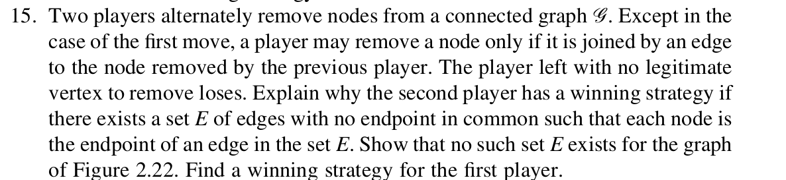
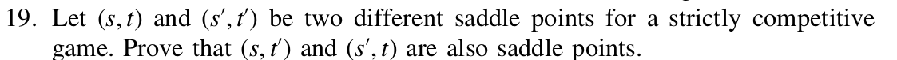
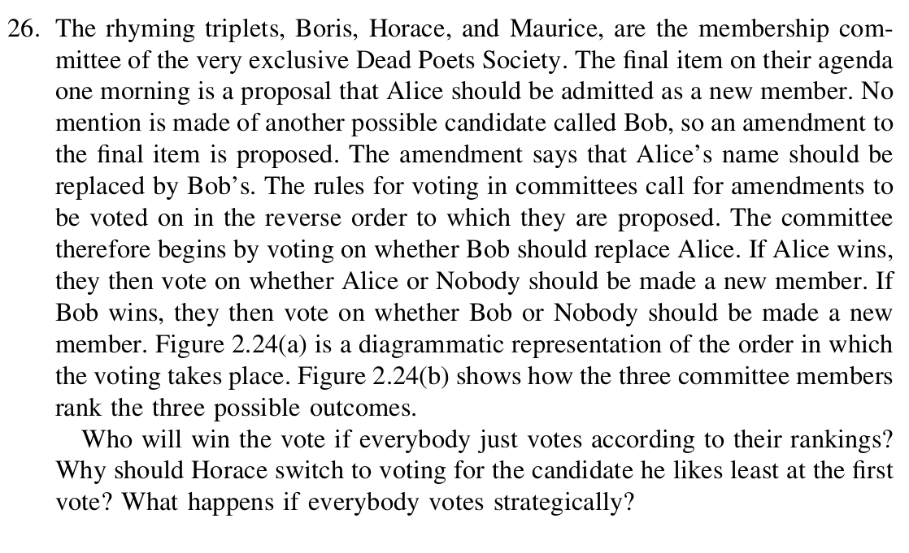

# EX1.

#### a.
the strategy of $A$ is $\{L, R\}$
strategy of $B$ is $\{(l,l), (l,r), (r,l), (r,r)\}$

Therefore, strategic form of this game shown as follow:

| A \ B | $(l,l)$ | $(l,r)$ | $(r,l)$ | $(r,r)$ |
| ----- | ----- | ----- | ----- | ----- |
| **L** | $u_1$ | $u_1$ | $u_2$ | $u_2$ |
| **R** | $u_3$ | $u_1$ | $u_3$ | $u_1$ |

#### b.
saddle points are $\{L, (l, r)\}, \{R, (l, r)\}$

#### c.
the value of this game is $u_1$

# EX2.

# EX3.

## EX4.

## EX5.
